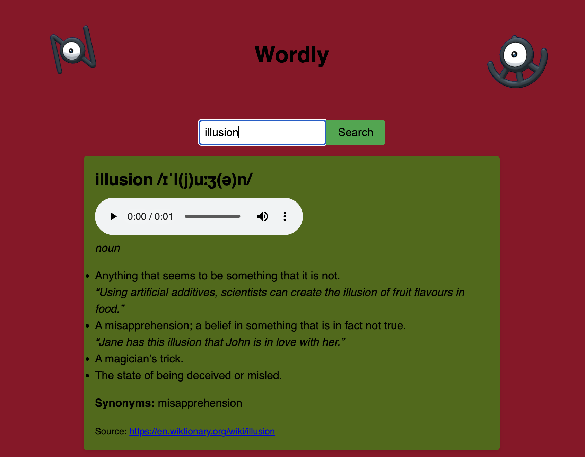

# Wordly Dictionary SPA

## Table of Contents

- [Demo](#demo)  
- [Setup](#setup)  
- [Testing](#testing)  
- [Usage](#usage)  
- [Performance Analysis](#performanceanalysis)  
---

## Demo

## Setup
1. Clone the repo
2. `npm install` (for Jest)
3. `open index.html` in your browser

## Testing
- Run `npm test` to execute the Jest suite.

## Usage
- Type a word into the search bar and hit **Search**.
- Definitions, pronunciations, and synonyms will appear without reloading the page.
- Errors (e.g., word not found) will be displayed inline.

## Performance Analysis
Big-O & File Placement:
The fetch and DOM update functions run in O(n) where n is the number of definitions + synonyms received. 
